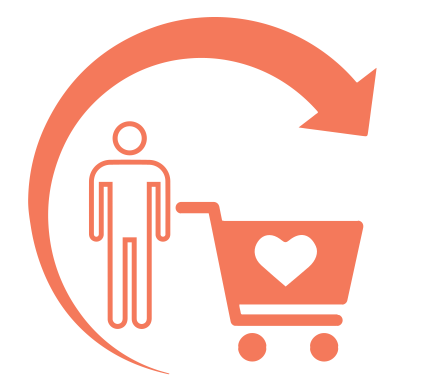
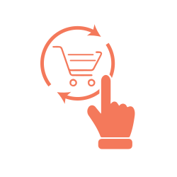

<container>

<headercontent>

# Next Order Coupon Generator for Shopify & WooCommerce Stores

It is ten times more expensive to acquire a customer, rather than retaining your existing customers.
Sending a next order coupon is one of the easiest ways to retain your customers and drive repeat
purchases.

<cta url="https://app.retainful.com/"
target="_blank" rel="noopener">Send Smart Coupons for Next Purchase for Free
</cta>

</headercontent>

</container>

<container>

## How Next Order Coupons Can Grow Your Revenue

 

<featurecontent featurebodysizeleft="6" featurebodysizerigth="6">

<row>

<column size="2" className="p-0 order-1">

</column>

<column size="10" className="p-0 order-2">

### Drive Repeat Purchases

When customers come back for more, your sales automatically grows and your average
Customer Lifetime Revenue increases. Next Order Coupons are a great motivation.

</column>

</row>

 

<row>

<column size="2" className="p-0 order-1">

</column>

<column size="10" className="p-0 order-2">

### Increase Customer Loyalty

Build loyal customers for your store by sending them next order coupons for every
purchase they make. That increases the customer engagement and stickiness.

</column>

</row>

 

<row>

<column size="2" className="p-0 order-1">

</column>

<column size="10" className="p-0 order-2">

### Increase Brand Awareness

Next order coupons help increase Word-of-Mouth Marketing and bring more customers to
your store.

</column>

</row>

</featurecontent>

</container>

<container>

## Features to Grow Your Store Revenue 10x Times

<featurecontent featurebodysizeleft="6" featurebodysizerigth="6">

### Unlimited Features. Unlimited Growth Opportunities

 

Retainful's Next Order Coupon generator comes with power-packed features that help grow your store
revenue in multiple ways. Also, make customers stick with your business for long by using next order
coupons.

 

- Automatically generate and send unique next order coupons with every purchase.

- Let customers automatically apply the coupon with a single click during their next purchase.

- Retainful's next order coupon generator is completely automated - generates and sends coupons
automatically when a customer completes a purchase.

- Check how much revenue next order coupons have made using real-time reports.

- Choose between coupon discount types - percentage/flat discounts.

- Manually set next order coupon values and coupon expiry date.

</featurecontent>

<featurecontent featurebodysizeleft="6" featurebodysizerigth="6" orderleft="order-two" orderright="order-one">

### Automated Email Reminders for Next Order Coupons

 

Just don't stop with sending the next order coupons. Customers often forget that they have a coupon
waiting for them. Let Retainful automatically remind the customers of their coupon for the next
purchase and win more sales for your store.

 

- Perfectly timed emails to remind customers on the coupons waiting for them

- Send a series of emails at intervals - Example: First reminder 10 days before expiry of coupon,
second reminder 3 days before and third reminder on the day of the expiry

- Use our pre-built email templates or create your own

- Power drag and drop editor helps you create emails in minutes

- Personalise the emails with the customer's name and more.

</featurecontent>

</container>

<row class="align-items-center">
<column size="4">

<strong>Puneet Sahalot</strong>

Founder, IdeaBox Creations

</column>
<column size="8">

<h4>Works like a charm. Perfect for WooCommerce stores.
Retainful is easy to use with a useful UI. Provides a lot of functionality even with the
free
tier. "Next Order coupon" is a simple and good way to increase the conversions and bring
back
your customers</h4>

</column>
</row>

<container>

## Store owners also love the following features of Retainful

Retainful helps store owners retain their customers and grow their revenue

<a class="program-card " href="/abandoned-cart-recovery">

Abandoned Cart Recovery

Recover abandoned carts and lost sales with Retainful. Stop carts from getting
abandoned, track abandoned carts and do more.

</a>

<a class="program-card" style="padding-bottom:43px;" href="/referrals">

Referrals (coming soon)

Turn your customers into brand advocates with a Referral program. Let your existing
customers bring new sales for your store.

</a>

</container>

</container>

<container>

<featurecontent featurebodysizeleft="6" featurebodysizerigth="6">

### Retainful Supports Platforms You Love

Just install and connect your store with Retainful

<cta url="https://app.retainful.com/"
target="_blank" class="btn-action">Get started FREE</cta>

<h4>Shopify</h4>

<h4>WooCommerce</h4>

</featurecontent>

</container>

