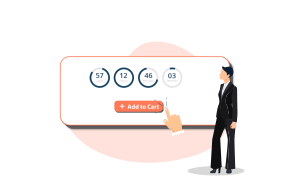

<container>

<headercontent>

# Retainful Premium for WooCommere Stores that Love Growth

Stop cart abandonment and convert more visitors into successful purchases with Retainful Premium features. Grow your sales number 10x times. 

<cta url="https://app.retainful.com/" rel="noopener" target="_blank">Get Started

</headercontent>

</container>

<container>

<featurecontent featurebodysizeleft="6" featurebodysizerigth="6">

## Add-to-Cart Email Capture Popups

 

Capture the customer's email before the checkout. You can trigger a popup to capture a customer's email when he adds an item to the cart. Since most visitors tend to abandon their shopping carts before reaching the checkout step, this feature allows you to collect email and send a reminder, if customers abandon the cart. Also, you can encourage customers to provide their email by offering them a discount. 

 

-   Popup is fully customizable to fit your branding and GDPR compliant.
    
-   Automatically trigger popup when visitors click "add to cart button".
    
-   Offer a coupon to motivate the customers to enter their email.

</featurecontent>

<featurecontent featurebodysizeleft="6" featurebodysizerigth="6" orderleft="order-two" orderright="order-one">

## Exit Intent Popups to Prevent Cart Abandonment

 

Catch the visitors when they try to leave your site, abandoning their carts, using the Exit Intent Popup. Exit popups are effective as they can be used to offer a motivation to complete their purchase. Studies show that exit popups can reduce abandoned carts by 64%.

 

-   Track visitor's movements and trigger a popup when the visitor is about to leave your website.
    
-   Fully customizable popup to fit your branding.
    
-   Show coupon code and auto apply it when the visitor clicks it.
    
-   Control when the popup should be triggered.

</featurecontent>

<featurecontent featurebodysizeleft="6" featurebodysizerigth="6">

## Countdown Timers to Create Urgency

 

Create a sense of urgency using countdown timers and motivate customers to complete their purchase. "Fear of Missing Out" has always worked well for eCommerce stores and adding a countdown timer on your store would increase engagement and purchases on your store - no doubts.

 

-   Display Sales Countdown Timer with custom messages & auto apply coupon codes.
    
-   Customize coupon codes with messages and expiry dates.
    
-   Decide where to display the countdown timer on your store - could be above the cart or below the coupon & more.

</featurecontent>

</container>

<container>

<featurecontent featurebodysizeleft="6" featurebodysizerigth="6">

### Retainful Supports Platforms You Love

Just install and connect your store with Retainful

<cta url="https://app.retainful.com/"
target="_blank" class="btn-action">Get started FREE</cta>

<h4>Shopify</h4>

<h4>WooCommerce</h4>

</featurecontent>

</container>