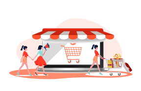
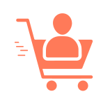
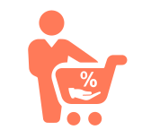
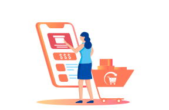
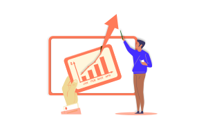
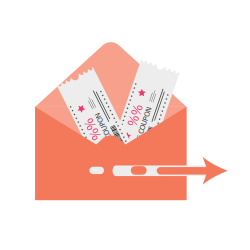

<container>

<headercontent>

# Grow sales organically with a Referral program

Turn your existing customers into brand advocates and grow your Word-of-Mouth sales without any additional
costs. Reward your customers for each successful referral and increase your engagement, while boosting sales
organically.

<cta url="https://app.retainful.com/"
target="_blank" rel="noopener">
GET STARTED
</cta>

</headercontent>

</container>

<container>

## How the Referral Program Works

 

<featurecontent featurebodysizeleft="6" featurebodysizerigth="6">

<row>

<column size="2" className="p-0 order-1">

</column>

<column size="10" className="p-0 order-2">

### Your customer refers a friend

Each customer in your store gets a unique link with a referral code. The customer invites
their friends using the link or the referral code to your store.

</column>

</row>

 

<row>

<column size="2" className="p-0 order-1">

</column>

<column size="10" className="p-0 order-2">

### Friend makes a purchase

The friend (referred person) visits your store using the unique link, enters his email to
get his discount code. And then makes a successful purchase.

</column>

</row>

 

<row>

<column size="2" className="p-0 order-1">

</column>

<column size="10" className="p-0 order-2">

### Your customer gets a reward (discount) too

Upon successful referral purchase, your customer gets a reward, which can be a percentage
discount or a flat discount or a free product. You can choose the type of the reward in the
Retainful settings.

</column>

</row>

</featurecontent>

</container>

<container>

## Why you should start a Referral program?

<featurecontent featurebodysizeleft="6" featurebodysizerigth="6" orderleft="order-two" orderright="order-one">

### Earn New Customers through Word-of-Mouth

 

Acquiring customers is costly and hard. But a Word-of-Mouth sale is 10x cheaper and has a higher
conversion rate. People usually trust recommendations from people they know. Your customers have an
immediate network that is full of people just like them, and those are the people who will buy and buy
again.

</featurecontent>

<featurecontent featurebodysizeleft="6" featurebodysizerigth="6">

### Build Customer Loyalty

 

By rewarding your customers for each referral, you continue to build trust and loyalty among your
customers. An increased engagement will help build a successful, long-terml relationship with your
customers, while growing sales with new and existing customers.

</featurecontent>

<featurecontent featurebodysizeleft="6" featurebodysizerigth="6" orderleft="order-two" orderright="order-one">

### Drive Repeat Sales

 

The best way to get repeat sales is to get more of the right customers, and the best way to get more of
the right customers is to deliberately leverage the network of the customers you already have. A
Referral program can help you turn your existing customers as your brand ambassadors and get more new
customers for you.

</featurecontent>

</container>

<container>

## Referral Program Features - Grow your Revenue 10x

<featurecontent featurebodysizeleft="6" featurebodysizerigth="6">

### Create and Run a Referral Program Effortlessly

 

Create a referral program for your store with Retainful and roll it out to your customers in minutes.
Just set up your advocate and friend rewards and let Retainful take care of the rest.

 

- It only takes a few minutes to go live with your Referral program
- Rewards can be Percentage discount, flat amount or free product
- Unique referral link for each customer
- Manage your referrals easily in Retainful dashboard
- Let your customers discount, join and engage with your referral program
- Customers can share via Facebook, Twitter or Email
- Track and manage your referral revenue in the Retainful dashboard

</featurecontent>

<featurecontent featurebodysizeleft="6" featurebodysizerigth="6" orderleft="order-two" orderright="order-one">

### Promote your Referral Program

 

Retainful can automatically enrol and notify your customers with their Refer-a-friend link after their
purchase. This makes it easy for you to promote your program and encourage your customers to recommend
their friends

 

- Notify customers with a "Refer-a-friend" link upon successful purchase
- Remind customers automatically if they have not referred any customers
- Notify customers upon successful referral purchases and their reward
- Automatic fraud prevention (based on the IPs and Emails)

</featurecontent>

</container>

<row class="align-items-center">
<column size="4">

<strong>Puneet Sahalot</strong>

Founder, IdeaBox Creations

</column>
<column size="8">

<h4>Works like a charm. Perfect for WooCommerce stores.
Retainful is easy to use with a useful UI. Provides a lot of functionality even with the free
tier. "Next Order coupon" is a simple and good way to increase the conversions and bring back
your customers
</h4>

</column>
</row>

<container>

## Store owners also love the following features of Retainful

Retainful helps store owners retain their customers and grow their revenue

<a class="program-card" style="padding-bottom: 80px;" href="/abandoned-cart-recovery">

Abandoned Cart Recovery

Recover abandoned carts and lost sales with Retainful. Stop carts from getting
abandoned, track abandoned carts and do more.

</a>

<a class="program-card" href="/next-order-coupon">

Next Order Coupons

Drive repeat purchases by sending a unique, single-use coupon code for the next
purchase when a customer buys something in your store. Remind them about the coupons
later automatically and drive repeat sales.

</a>

</container>

<container>

<featurecontent featurebodysizeleft="6" featurebodysizerigth="6">

### Retainful Supports Platforms You Love

Just install and connect your store with Retainful

<cta url="https://app.retainful.com/" target="_blank" class="btn-action">Get started FREE</cta>

<h4>Shopify</h4>

<h4>WooCommerce</h4>

</featurecontent>

</container>

</container>

</container>

</container>

</container>

</container>
