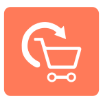
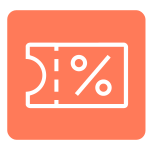
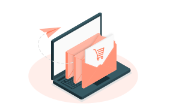
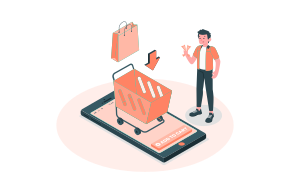

<container>

# Recover Abandoned Checkouts and Drive Repeat Purchases in Autopilot mode.

Grow revenue 10x by recovering your lost revenue with Retainful. Automate your abandoned cart recovery campaigns. Motivate your customers to come back for more by sending unique, single use coupons for their next purchase.

<cta url="https://app.retainful.com" rel="noopener" target="_blank">Get Started for Free</cta>

<h2 class="reward-programs-grid-title">Features to Grow Your Shopify Store Revenue</h2>

<h2 class="reward-program-title">Abandoned Cart Recovery
</h2>

Track and recover abandoned carts in autopilot. Send well-timed email follow-ups for abandoned carts.

<h2 class="reward-program-title">Next Order Coupons</h2>

Auto generate and send a unique, single-use coupon for the next purchase whenever a customer makes a purchase. 

<h2 class="reward-program-title">Referrals (coming soon)</h2>

Turn your customers into brand advocates and refer to their friends. Increase sales through word of mouth referrals.

</container>

## Join 1000+ Shopify stores & start recovering abandoned carts in autopilot

<container>

<featurecontent featurebodysizeleft="6" featurebodysizerigth="6">

### Powerful Abandoned Cart Recovery Emails

 

7 out of 10 customers leave your Shopify store without purchasing. Sending them a well-timed   email follow-ups can boost your revenue at least by 40%. 
Retainful lets you create personalised cart recovery emails and send them in autopilot mode. Get started quickly using our pre-built email templates or create a new with our easy-to-use drag and drop editor.

</featurecontent>

<featurecontent featurebodysizeleft="6" featurebodysizerigth="6" orderleft="order-two" orderright="order-one">

### Next Order Coupons to Drive Repeat Purchases 

 

Send unique coupons for the next purchase for every successful order. Coupons are a great motivator to get your customers purchases more often in your store. The coupons are auto-generated, unique, single-use and they can have an expiry time. Also, send perfectly-timed  email follow-ups to remind customers about the expiring coupon.

</featurecontent>

<featurecontent featurebodysizeleft="6" featurebodysizerigth="6">

### Referral Program to Increase Customers (coming soon)

 

Your customers can be your brand ambassadors. If they are buying, so are their friends. Turn your customers into brand advocates and refer their friends to you. Run campaigns like Give $20, Get $20 rewards easily in your store.

</featurecontent>

</container>

<container>

<row class="align-items-center justify-content-center mb-5">

<column size="10">

### Get started with Retainful in 2 simple steps

</column>

<column size="5">

1. Connect your store with Retainful.

2. Create an abandoned cart email template.

</column>

</row>

</container>

</container>

<funnel bgcolor="#2e57bf" color="#fff">

<row class="align-items-center justify-content-center">

<column size="12">

#### Let Retainful do the magic of automatically tracking your abandoned carts and recovering them.

<cta  url="https://app.retainful.com" rel="noopener" target="_blank">Get Started for Free</cta>

</column>

</row>

</funnel>
